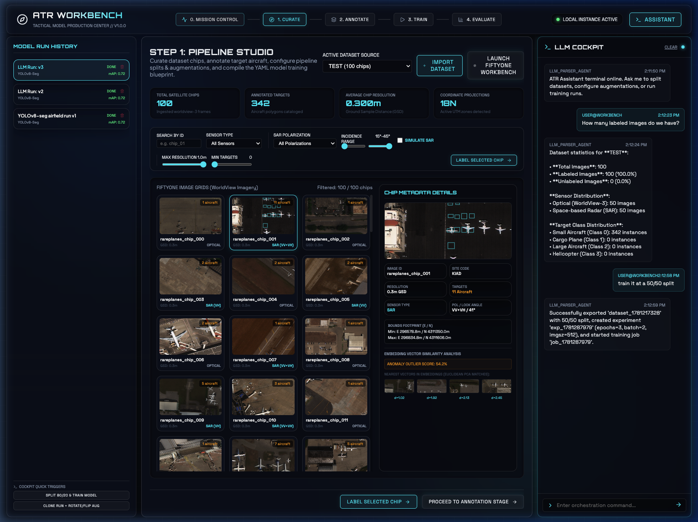
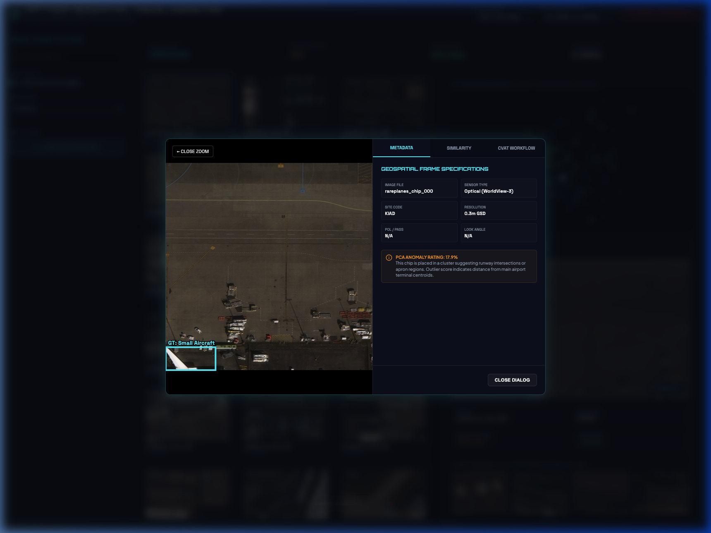
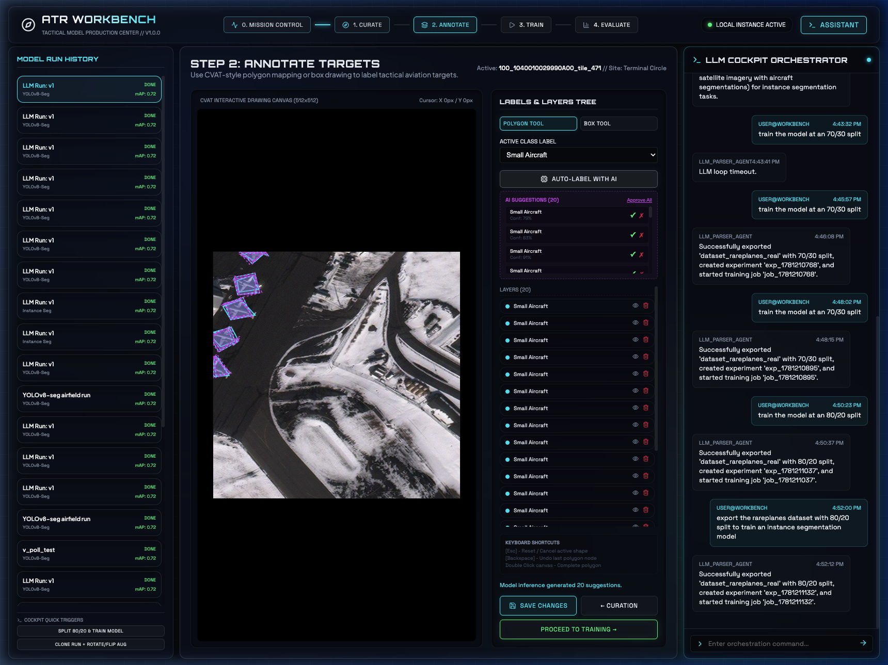
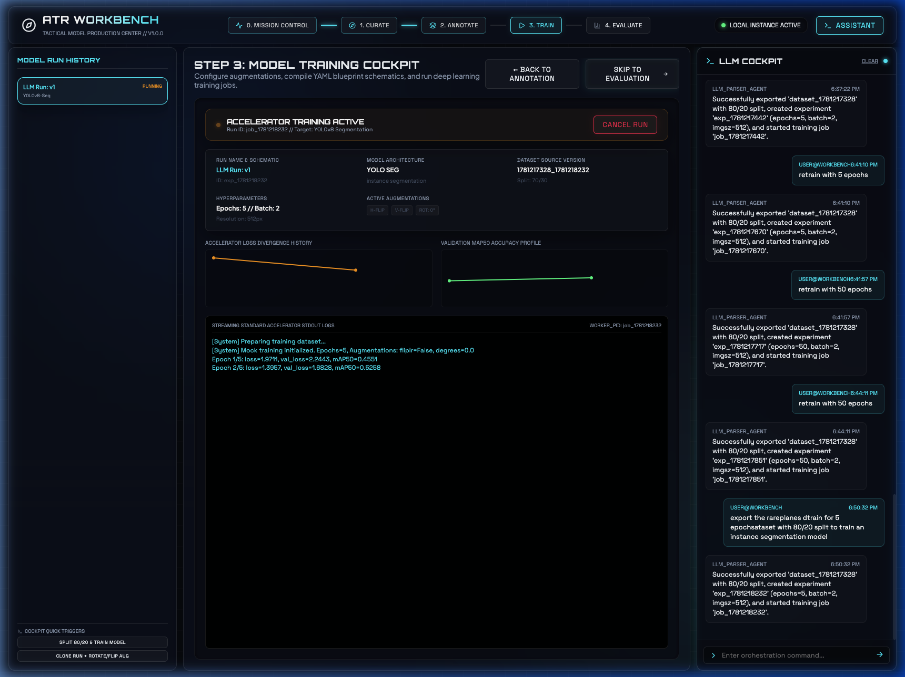
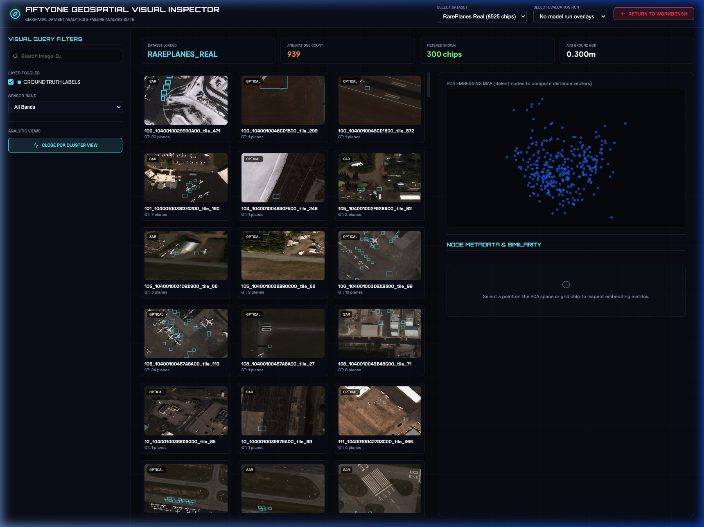

# ATR Model Production Workbench

Welcome to the **ATR (Automatic Target Recognition) Model Production Workbench**. This is a tactical, premium web application designed to curate satellite datasets, edit target annotations with AI assistance, configure and run YOLO instance segmentation models, and analyze results using a custom interactive embedding and failure analysis dashboard.

---

## 🚀 Quick Start

Follow these steps to configure, install, and launch the workbench.

### 1. Prerequisites
Ensure you have the following installed on your system:
* **Python 3.10 or higher**
* **Node.js v18 or higher** and **npm**
* **lsof** (default on macOS/Linux, used to manage server ports)

### 2. Configuration (`.env`)
The application uses a `.env` file at the root for environment variables (e.g., Gemini API keys for NL commands and AI annotation suggestions). 

1. Copy `.env.example` to `.env`:
   ```bash
   cp .env.example .env
   ```
2. Open `.env` and replace `your_gemini_api_key_here` with your actual Gemini API Key:
   ```env
   GEMINI_API_KEY=AIzaSy...
   ```

### 3. Installation & Setup (`./setup.sh`)
Run the setup script from the root of the project to initialize the python virtual environment, download model libraries, and install frontend dependencies.

```bash
# Make the script executable
chmod +x setup.sh

# Run the setup script
./setup.sh
```

**What the setup script does:**
* Verifies your Python 3 and Node.js/npm environments.
* Creates a Python virtual environment (`venv`) inside the `backend/` folder.
* Installs backend requirements from `backend/requirements.txt` (FastAPI, Uvicorn, Ultralytics, Pydantic).
* Installs frontend packages inside `frontend/` using `npm install`.

### 4. Running the Workbench (`./start.sh`)
Start both the FastAPI backend and Vite frontend with a single command:

```bash
# Make the script executable
chmod +x start.sh

# Start the workbench
./start.sh
```

**What the start script does:**
* Checks if port `8000` (FastAPI) or `5173` (Vite dev server) is in use, and automatically terminates existing processes running on those ports to prevent startup conflicts.
* Activates the backend `venv` and runs the FastAPI server on `http://127.0.0.1:8000` with hot-reloading.
* Launches the React frontend development server on `http://localhost:5173`.
* Monitors both servers and handles cleanup (graceful termination of background processes) when you press `Ctrl+C`.

---

## 🗺️ System Architecture

The project is structured into two main components:

```
EMSI-Challenge/
├── backend/                  # FastAPI Python Backend
│   ├── app/
│   │   ├── db/              # SQLite database initialization and schema
│   │   ├── services/        # AI orchestration, dataset compilation & evaluation services
│   │   ├── workers/         # Background model training worker tasks
│   │   ├── main.py          # FastAPI application entrypoint and router endpoints
│   │   └── mcp_server.py    # MCP Integration layer for agent operations
│   ├── create_rareplanes_zip.py # Utility to prepare training data
│   ├── rareplanes_train.zip # Extracted dataset package
│   └── requirements.txt     # Python package dependencies
├── frontend/                 # React Vite TypeScript Frontend
│   ├── src/
│   │   ├── App.tsx          # Main Workbench cockpit layout & wizard steps
│   │   ├── FiftyOneDashboard.tsx # Standalone visual failure analysis workspace
│   │   ├── ProjectDashboardView.tsx # Project summary analytics
│   │   ├── index.css        # Global dark-theme glassmorphic styles
│   │   └── main.tsx         # React root entrypoint
│   └── package.json         # Node package dependencies
├── setup.sh                  # Setup script
└── start.sh                  # Startup script
```

---

## 🎨 Feature Walkthrough & Screenshots

The workbench interface features a tactical, dark-mode glassmorphic HUD designed for satellite image curation, labeling, and training tracking.

### 1. Mission Control Dashboard
Upon launching, the workbench presents a global view of your workspace:
* **Dataset Analytics**: Displays total images, classes, dimensions, annotations, and sensor types.
* **Run History**: Tracks active, completed, and terminated training runs. Run versions (e.g., `run_v1`, `run_v2`) auto-increment based on SQLite run logs.
* **Telemetry Console**: Real-time console logs from the active backend services.
* **Dataset Upload**: Allows drag-and-drop or file selection of custom ZIP datasets containing COCO annotations.

---

### 2. Step 1: Dataset Curation Workspace
A comprehensive view that lists and details geospatial satellite image chips.


*Figure 1: Dataset curation workspace displaying the WorldView Image Grid and details panel.*

#### Image Inspection
* **Single Click**: Updates the metadata details panel in the sidebar with target counts, sensor configurations, resolution (GSD), site codes, bounds footprints, Euclidean PCA nearest-neighbor similarity vectors, and anomaly outlier scores.
* **Double Click or "Zoom Chip"**: Open a full-screen high-resolution viewer modal to closely inspect targets.


*Figure 2: Interactive Zoom Modal overlay allowing detailed inspection of objects.*

---

### 3. Step 2: Target Annotation
An interactive polygon labeling utility built for precise manual annotation:
* **CVAT-style Editor**: Add new polygon nodes, edit points, delete nodes, or change class types (e.g., *Small Aircraft*, *Cargo Plane*, *Large Aircraft*, *Helicopter*).
* **AI-Assisted Segmentation**: Click the **Suggest Annotations** button to invoke the FastAPI AI backend, drawing automated target boundaries using the Gemini API.


*Figure 3: Semantic target annotation workflow featuring interactive node manipulation and AI polygon auto-generation.*

---

### 4. Step 3: Training Cockpit
A cockpit dashboard to configure and monitor YOLOv8 instance segmentation runs:
* **YOLO Configuration Form**: Configure Epochs, Batch Size, Image Size, Train/Val split ratio, Random Seeds, and Data Augmentations (horizontal/vertical flips, rotational degrees).
* **Auto-Increment Tagging**: Model version tags are automatically generated to follow your version history sequentially.
* **Real-time Live Telemetry**: Renders live training telemetry charts (dynamic SVGs showing Train/Val Loss, Precision, Recall, and mAP50 metrics), active epoch progress meters, speed indices (ms/step), and log feeds.
* **Job Control**: Click **Terminate Training** to safely abort active runs, which halts the backend worker process and updates the SQLite database state cleanly.


*Figure 4: Training workspace showing telemetry line charts, epoch speed bars, and the abort safety switch.*

---

### 5. Step 4: Model Comparison & Evaluation
* Pick any two completed model runs from the database and trigger a side-by-side metric comparison.
* View mAP curves, validation matrices, and loss differences.

---

### 6. FiftyOne Standalone Failure Analysis Suite (`/fiftyone`)
Access this standalone diagnostic interface by navigating to `http://localhost:5173/fiftyone` (or click the **Launch FiftyOne** action in the workbench).

This page is designed for target detection failure triage:
* **Analytics Filters**: A sidebar controller allowing you to adjust Confidence Thresholds, show/hide Ground Truth or Predictions, filter by Sensor Types, or isolate True Positives (TP), False Positives (FP), and False Negatives (FN).
* **Outlier & Vector Matches**: Computes outlier scores to detect abnormal images and lists the closest feature vector matches for visual similarities.
* **PCA Query Map & Lasso Selection**: Includes an interactive PCA map showing model predictions, complete with custom SVG lassoing to isolate groups of model failures.
* **Interactive Inspector**: Single-click image items to view prediction confidences, label statuses, and outlier scores in the details sidebar; double-click or click **Zoom Chip** to inspect detections under high magnification.


*Figure 5: Standalone failure diagnostics dashboard with custom dataset evaluations, predictions filtering, and outliers identification.*

---

## 🛠️ API Endpoints

The backend exposes a FastAPI REST API:

| Endpoint | Method | Description |
|---|---|---|
| `/api/initialize` | `POST` | Scans directories, extracts zip files, and sets up project databases. |
| `/api/datasets` | `GET` | Lists available image datasets. |
| `/api/datasets/{id}/images/{img_id}` | `GET` | Fetches a static image asset. |
| `/api/datasets/{id}/embeddings` | `GET` | Returns PCA embedding coordinates and scene types. |
| `/api/train` | `POST` | Initiates YOLO training background task. |
| `/api/train/terminate` | `POST` | Terminates active training task. |
| `/api/experiments` | `GET` | Lists all model training runs and status. |
| `/api/experiments/{id}/evaluation` | `GET` | Fetches YOLO evaluation metrics (TP/FP/FN/mAP). |
